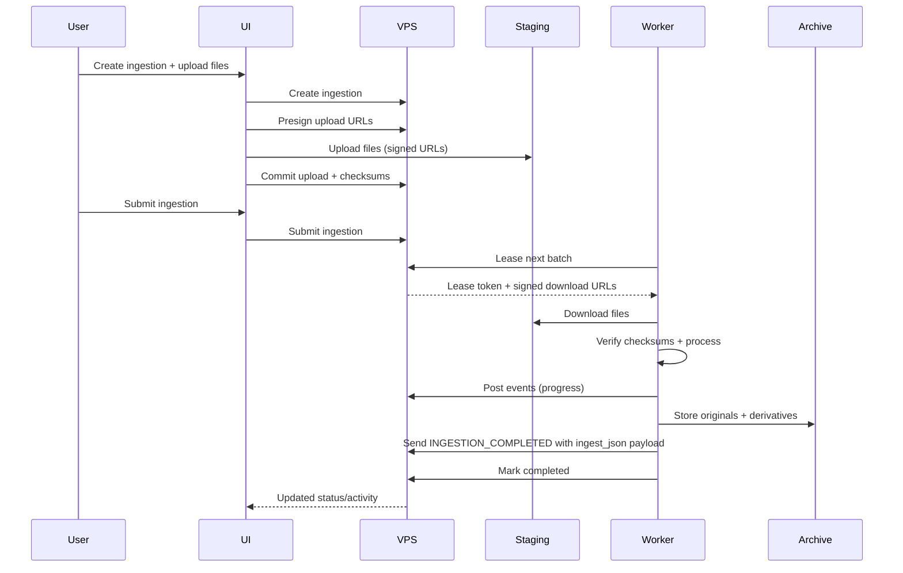

# Overall System Interaction Architecture

This document describes how the Osimi backend control plane (VPS) interacts with the private home archive worker and storage.

## Overview

- Public VPS hosts the web UI and REST API
- VPS stores uploaded batches temporarily in staging storage
- Home archive worker runs behind NAT/firewall with outbound-only access
- Home archive storage holds originals and derived artifacts permanently

## Components

- Web UI (public)
- VPS API (public)
- VPS Postgres (state, events, leases)
- VPS staging storage (temporary uploads)
- Home worker (private ingestion pipelines)
- Home archive storage (permanent originals + derivatives)

## Interaction Flow

1) User creates ingestion and uploads files to VPS staging
2) User submits ingestion for processing
3) Home worker leases a batch from VPS (outbound request)
4) VPS returns lease token + signed download URLs
5) Worker downloads files, verifies checksums, runs pipelines
6) Worker posts progress/events to VPS (including archive-generated `object_id` on completion/object events)
7) Worker sends `ingest_json` in completion event payload
8) VPS marks ingestion complete and UI updates

## Data Ownership

- Staging storage: temporary batch files on VPS
- Archive storage: permanent originals + derivatives on home server
- Object identity (`object_id`): generated by Archive System and treated as authoritative by VPS
- ingest.json: permanent JSON document stored on `objects.ingest_manifest` on VPS

## Security Boundaries

- Worker never receives inbound requests
- All worker actions require a signed lease token
- Download URLs are short-lived and scoped to a single batch
- Upload URLs are short-lived and scoped to a single file
- Tenant scoping enforced on all endpoints

## Failure and Recovery

- Lease expiry re-queues ingestions for another worker
- Redundancy sweep re-queues expired leases if auto-requeue fails
- Failed/canceled ingestions retain staging data for a limited time
- Stuck ingestions are flagged for user attention (no auto-purge)

## Sequence Diagram

